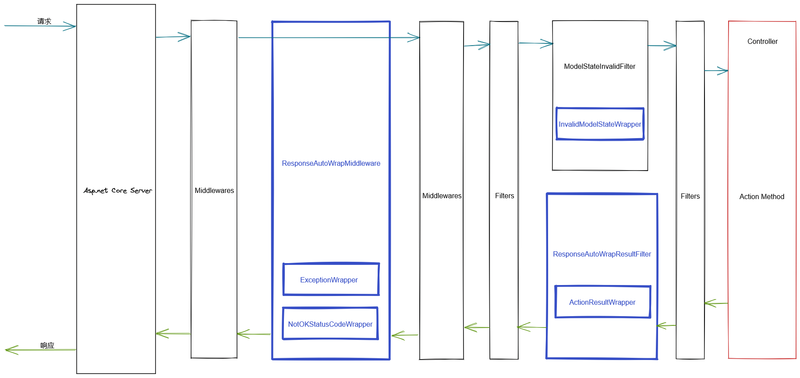

# Cuture.AspNetCore.ResponseAutoWrapper
## 1. Intro
用于`asp.net core`的响应和异常自动包装器，使`Action`提供一致的响应内容格式

- 不需要修改 `Controller` 的 `Action` 返回类型即可自动包装；
- 支持`Swagger`，能够正确展示包装后的类型结构；
- 支持自定义响应结构、自定义异常解析，取消状态码覆写等；
- 支持复杂类型的 `Code` 和 `Message`，不局限于 `int` 和 `string`；
- 基于`asp.net core`自身的特性实现，兼容性较好，性能影响较低（目前只做了初步的测试，在简单场景下，性能降低大概在`5%`左右）；
- 灵活的筛选方式，可以更准确的筛选出不需要包装的Action；

### NOTE!!!
- 不支持包装 `Middleware` 直接写入的响应内容，以及各种直接 `Map` 的 `MiniApi`；（但出现异常时还是会触发异常包装）


执行流程概览：


## 2. 注意项
- 目标框架`net8.0+`
- 包装功能由两个包装器实现：
    - 基于`ResultFilter`的`ActionResult`包装器：针对方法的返回值包装；
    - 基于`中间件`的包装器：针对异常、非200响应包装；
- 默认响应格式为
    ```json
    {
        "code": 200,  //状态码 (int)
        "message": "string", //消息 (string)
        "data": {}  //Action的原始响应内容
    }
    ```
- 四个针对场景的包装器（都已经有默认实现，可以自行实现后注入DI容器，替换默认的功能）：
    - `IActionResultWrapper<TResponse, TCode, TMessage>`: 针对`ActionResult`的包装器；
    - `IExceptionWrapper<TResponse, TCode, TMessage>`: 针对`中间件中捕获到异常`的包装器；
    - `IInvalidModelStateWrapper<TResponse, TCode, TMessage>`: `参数验证失败`的包装器；
    - `INotOKStatusCodeWrapper<TResponse, TCode, TMessage>`: 中间件中`StatusCode`非`200`的响应包装器；
- 默认的`IActionResultWrapper`实现只会处理`ObjectResult`、`EmptyResult`；

### 可能与其它第三方组件存在的冲突点
- `ResultFilter`中会频繁`未加锁`读取`ActionDescriptor.Properties`，如果存在不正确的写入，可能引发一些问题；
- 使用动态添加`ProducesResponseTypeAttribute`的方式实现的`OpenAPI`支持，可能存在不完善的地方；
- `授权`和`认证`失败的包装需要手动指定对应组件的失败处理方法，否则可能无法包装；
- 参数验证失败的包装通过设置`ApiBehaviorOptions.InvalidModelStateResponseFactory`实现，可能有处理逻辑冲突；

## 3. 如何使用

### 3.1 安装`Nuget`包

```PowerShell
Install-Package Cuture.AspNetCore.ResponseAutoWrapper
```

### 3.2 启用`ResultFilter`包装器

在`Startup.ConfigureServices`中添加相关服务并进行配置

```C#
services.AddResponseAutoWrapper(options =>
{
    //options.ActionNoWrapPredicate     //Action的筛选委托，默认会过滤掉标记了NoResponseWrapAttribute的方法
    //options.DisableOpenAPISupport     //禁用OpenAPI支持，Swagger将不会显示包装后的格式，也会解除响应类型必须为object泛型的限制
    //options.HandleAuthorizationResult     //处理授权结果（可能无效，需要自行测试）
    //options.HandleInvalidModelState       //处理无效模型状态
    //options.RewriteStatusCode;     //包装时不覆写非200的HTTP状态码
});
```

### 3.3 启用中间件包装器

在`Startup.Configure`中启用中间件并进行配置

```C#
app.UseResponseAutoWrapper(options =>
{
    //options.CatchExceptions 是否捕获异常
    //options.ThrowCaughtExceptions 捕获到异常处理结束后，是否再将异常抛出
    //options.DefaultOutputFormatterSelector 默认输出格式化器选择委托，选择在请求中无 Accept 时，用于格式化响应的 IOutputFormatter
});
```

#### 至此所有相关配置完成，`Action`的响应内容将被自动包装；

-------

## 4. 定制化

### 4.1 自定义消息内容
 - 方法一：Action方法直接返回`TResponse`及其子类时，不会对其进行包装，默认`TResponse`为`GenericApiResponse<int, string, object>`，使用默认配置时，方法直接返回`ApiResponse`及其子类即可
    ```C#
    [HttpGet]
    public ApiResponse GetWithCustomMessage()
    {
        return EmptyApiResponse.Create("自定义消息");
    }
    ```

    返回结果为
    ```json
    {
    "data": null,
    "code": 200,
    "message": "自定义消息"
    }
    ```

 - 方法二：通过`Microsoft.AspNetCore.Http`命名空间下`HttpContext`的拓展方法`DescribeResponse<TCode, TMessage>`进行描述
    ```C#
    [HttpGet]
    public WeatherForecast[] Get()
    {
        HttpContext.DescribeResponse(10086, "Hello world!");
        return null;
    }
    ```

    返回结果为
    ```json
    {
    "data": null,
    "code": 10086,
    "message": "Hello world!"
    }
    ```

### 4.2 自定义统一响应类型`TResponse`
默认的`ApiResponse`不能满足需求时，可自行实现并替换`TResponse`

#### 4.1.1 定义类型
```C#
public class CommonResponse<TData>
{
    public string Code { get; set; }

    public string Tips { get; set; }

    public TData Result { get; set; }
}
```
 - `Data` 对应的泛型参数必须为最后一个泛型参数；
 - 当禁用 `OpenAPI支持` 时，响应类型可以不是泛型；

#### 4.1.2 实现Wrapper
Wrapper可以自行分别实现每个接口，也可以继承 `AbstractResponseWrapper<TResponse, TCode, TMessage>` 快速实现

```C#
public class CustomWrapper : AbstractResponseWrapper<CommonResponse<object>, string, string>
{
    public CustomWrapper(IWrapTypeCreator<string, string> wrapTypeCreator, IOptions<ResponseAutoWrapperOptions> optionsAccessor) : base(wrapTypeCreator, optionsAccessor)
    {
    }

    public override CommonResponse<object>? ExceptionWrap(HttpContext context, Exception exception)
    {
        return new CommonResponse<object>() { Code = "E4000", Tips = "SERVER ERROR" };
    }

    public override CommonResponse<object>? InvalidModelStateWrap(ActionContext context)
    {
        return new CommonResponse<object>() { Code = "E3000", Tips = "SERVER ERROR" };
    }

    public override CommonResponse<object>? NotOKStatusCodeWrap(HttpContext context)
    {
        return null;
    }

    protected override CommonResponse<object>? ActionEmptyResultWrap(ResultExecutingContext context, EmptyResult emptyResult, ResponseDescription<string, string>? description)
    {
        return new CommonResponse<object>() { Code = description?.Code ?? "E2000", Tips = description?.Message ?? "NO CONTENT" };
    }

    protected override CommonResponse<object>? ActionObjectResultWrap(ResultExecutingContext context, ObjectResult objectResult, ResponseDescription<string, string>? description)
    {
        return new CommonResponse<object>() { Code = description?.Code ?? "E2000", Tips = description?.Message ?? "NO CONTENT", Result = objectResult.Value };
    }
}
```

 - 当 `wrapper` 返回 `null` 时，则不进行包装；

#### 4.1.3 配置使用自定义类型

```C#
services.AddResponseAutoWrapper<CommonResponse<object>, string, string>()
        .ConfigureWrappers(options => options.AddWrappers<CustomWrapper>());
```

 - Response `Data` 对应的泛型参数在此处必须为 `object`；
 - 此示例中 `TCode` 为 `string`，`TMessage` 为 `string`，则使用 `DescribeResponse` 进行描述时，参数类型必须对应为 `string`, `string`；

至此已完成配置，统一响应内容格式变更为：
```json
{
    "code": "string",
    "tips": "string",
    "result": {}
}
```

------

## Note!!!
 - 仅当`禁用OpenAPI支持时`，`TResponse`才能不是一个泛型参数为`object`的泛型；
 - 更多信息可参考 `sample/CustomStructureWebApplication`、`sample/SimpleWebApplication` 以及 `test/ResponseAutoWrapper.TestHost` 项目；
 - 默认情况下不会包装使用`[NoResponseWrapAttribute]`标记的方法；

### 4.3 其它自定义

使用自行实现的接口注入DI容器替换掉默认实现即可完成一些其它的自定义

- `IActionResultWrapper<TResponse, TCode, TMessage>`: ActionResult包装器；
- `IExceptionWrapper<TResponse, TCode, TMessage>`: 捕获异常时的响应包装器；
- `IInvalidModelStateWrapper<TResponse, TCode, TMessage>`: 模型验证失败时的响应包装器；
- `INotOKStatusCodeWrapper<TResponse, TCode, TMessage>`: 非200状态码时的响应包装器；
- `IWrapTypeCreator<TCode, TMessage>`: 确认Action返回对象类型是否需要包装，以及创建OpenAPI展示的泛型类；

### 4.4 动态取消包装
调用 `HttpContext` 的拓展方法 `DoNotWrapResponse` ，以动态的取消对当前响应的包装；使用拓展方法 `IsSetDoNotWrapResponse` 可以检查当前上下文是否已标记为不包装响应值；
```C#
HttpContext.DoNotWrapResponse();
```

## 5. 性能测试结果

#### 多次迭代后，数据可能略微变动，但影响理论上仍然是固定比例的，不会随响应内容大小而变化

- 系统：`Ubuntu20.04 on WSL2` host by Windows10-21H1
- CPU：`I7-8700`
- 平台：`asp.net core 5.0`
- 测试软件：`wrk`
- 测试软件参数：`-t 3 -c 100 -d 30s`
- 测试Action为：
    ```C#
    [HttpGet]
    public IEnumerable<WeatherForecast> Get(int count = 5)
    {
        return WeatherForecast.GenerateData(count);
    }
    ```
- 测试均为使用`localhost`，以尽量减少网络的影响；
- 对比对象分别为：
    - Origin：原生，没有进行包装
    - Cuture.AspNetCore.ResponseAutoWrapper：此自动包装库
    - [AutoWrapper.Core](https://github.com/proudmonkey/AutoWrapper)：另一个同类型的自动包装库
- 结果为多次运行取峰值；
- 测试环境不专业，会有一定的误差，数值仅供参考；

### 数据（单位 `Requests/sec`）
|`count`      |      Origin              |Cuture.AspNetCore.ResponseAutoWrapper|   AutoWrapper.Core      |
|   ----      |   ----                   |                ----                 |         ----            |
| 1           |123267.40                 |111868.34                            |91202.04                 |
| 10          |108264.80                 |103125.32                            |67001.92                 |
| 50          |76310.72                  |73451.83                             |32275.47                 |
